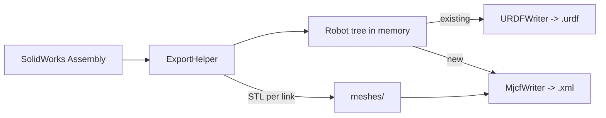

## High-level approach

The tool's intermediate representation ([SW2URDF/URDF/Robot.cs](SW2URDF/URDF/Robot.cs) → `Link` → `Joint`) already captures everything needed to emit MJCF. Rather than duplicate the element hierarchy, we add a translator (`MjcfWriter`) that consumes the same `Robot` tree and writes MJCF-nested bodies. A small SolidWorks-side export helper produces meshes in STL (MJCF-compatible) and lays out a lean MuJoCo package.

Keep the URDF flow untouched. Add a new code-path triggered by a dedicated button so MJCF-only options (actuators, compiler flags, integrator, gravity) can be surfaced without confusing URDF users.

### Data flow




## Files to add

- `SW2URDF/MJCF/MjcfWriter.cs` – core translator. Walks `Robot.BaseLink`, emits nested `<body>` elements with `<joint>`, `<inertial>`, `<geom>` (visual group=1 and collision group=3), and references meshes declared in `<asset>`. Maps:
  - URDF `revolute`/`continuous` → `<joint type="hinge">` (with/without `range`)
  - URDF `prismatic` → `<joint type="slide">`
  - URDF `fixed` → no `<joint>` (nested body inherits parent frame)
  - URDF `floating` → `<joint type="free"/>`
  - URDF `planar` → two orthogonal `<joint type="slide"/>` in-plane
  - Origin `xyz`+`rpy` → `pos` and `euler` on the child `<body>`
  - `<inertial>` → MJCF `<inertial pos="…" mass="…" fullinertia="ixx iyy izz ixy ixz iyz"/>`
  - Limits/dynamics → `range`, `damping`, `frictionloss` on the joint
  - Mimic joints → emit `<equality><joint .../></equality>` entries collected during traversal
  - Adjacent parent/child links → optional `<contact><exclude/></contact>` pairs
  - For each name in `link.SiteCoordSystemNames`, emit a `<site>` inside the body, using the SolidWorks coord-system transform relative to the link's joint frame (reusing `MathOps.GetTransformation` and the existing coord-system lookup in [SW2URDF/URDFExport/ExportHelper.cs](SW2URDF/URDFExport/ExportHelper.cs))
- `SW2URDF/MJCF/MjcfOptions.cs` – POCO holding timestep, gravity, integrator (`Euler`/`RK4`/`implicit`), `meshdir`, whether to auto-generate actuators, actuator type (`motor`/`position`/`velocity`), and default gains.
- `SW2URDF/UI/MjcfOptionsDialog.cs` (+ `.Designer.cs`, `.resx`) – small modal form opened by the new button; edits an `MjcfOptions` instance.
- `SW2URDF/MJCF/MjcfPackage.cs` – lightweight directory layout builder: `<name>/<name>.xml`, `<name>/meshes/`, `<name>/README.md`. No ROS/CMake/launch files.

## Files to modify

- [SW2URDF/URDF/Link.cs](SW2URDF/URDF/Link.cs)
  - Add `[DataMember] public List<string> SiteCoordSystemNames` (initialized to empty list) — the names of SolidWorks reference coord systems the user has elected to expose as MJCF `<site>` elements.
  - Extend `AppendToCSVDictionary` / `SetElementFromData` to serialize the list (semicolon-joined, matching the `SWComponents` convention used in the existing `Link.AppendToCSVDictionary`).
  - `Link.Clone()` / `SetElement` must copy the list so existing operations (merge, CSV import) keep working.
- [SW2URDF/URDFExport/ExportHelper.cs](SW2URDF/URDFExport/ExportHelper.cs)
  - Add `public void ExportMjcf(MjcfOptions options)` that mirrors the STL-export portion of `ExportRobot` (save/restore user preferences, `SetSTLExportPreferences`, per-link `SaveSTL` into the MJCF package's `meshes/` directory), then calls `MjcfWriter.Write(URDFRobot, options, path)` instead of `URDFWriter`.
  - Refactor the mesh-export inner loop (currently inside `ExportFiles`) so it can be invoked in either flow without duplicating the preference-shuffling code.
  - Expose a helper to resolve each `SiteCoordSystemNames` entry to its link-local pose for the writer.
- [SW2URDF/UI/AssemblyExportForm.Designer.cs](SW2URDF/UI/AssemblyExportForm.Designer.cs) and [SW2URDF/UI/AssemblyExportForm.cs](SW2URDF/UI/AssemblyExportForm.cs)
  - Add a `Sites` group box to the per-link property panel, containing a `CheckedListBox` populated with that link's available reference coord systems (from `ReferenceCoordinateSystemNames`, minus the one already used as the joint origin). Checked entries populate `Link.SiteCoordSystemNames`.
  - Wire this into `SaveLinkDataFromPropertyBoxes` / `FillLinkPropertyBoxes` (see how `comboBoxCoordSys` is populated today) so selections round-trip with tree navigation and CSV import/export.
  - Add `buttonExportMjcf` next to `buttonLinksFinish` / `buttonLinksExportUrdfOnly`.
  - Add `FinishMjcfExport()` mirroring `FinishExport` at lines 251–328: validate the link tree, prompt the user with `MjcfOptionsDialog`, `SaveFileDialog`, then call `Exporter.ExportMjcf(options)`. MJCF is STL-only, so the existing `radioButton3dxml` is ignored for this flow.
- [SW2URDF/SW2URDF.csproj](SW2URDF/SW2URDF.csproj) – add `<Compile>` and `<EmbeddedResource>` entries for the new MJCF and UI files.

## MJCF structure (intended output shape)

```xml
<mujoco model="my_robot">
  <compiler angle="radian" meshdir="meshes" autolimits="true"/>
  <option timestep="0.002" integrator="RK4" gravity="0 0 -9.81"/>
  <default>
    <geom friction="1 0.005 0.0001"/>
    <joint damping="0.1"/>
  </default>
  <asset>
    <mesh name="base_link" file="base_link.STL"/>
  </asset>
  <worldbody>
    <body name="base_link" pos="0 0 0">
      <inertial pos="..." mass="..." fullinertia="..."/>
      <geom type="mesh" mesh="base_link" group="1"/>
      <geom type="mesh" mesh="base_link" group="3" contype="1" conaffinity="1"/>
      <body name="link1" pos="..." euler="...">
        <joint name="joint1" type="hinge" axis="0 0 1" range="..." damping="..."/>
        <site name="tool_tip" pos="..." euler="..."/>
      </body>
    </body>
  </worldbody>
  <equality/>
  <contact/>
  <actuator/>
</mujoco>
```

## Testing

- Add `SW2URDF/Test/TestMjcfWriter.cs` with unit tests that build small synthetic `Robot` trees (single body, chain of three revolute, mimic pair, floating base) and assert key XML structure via `XDocument` XPath queries — no SolidWorks required.
- Extend [SW2URDF/Test/TestExportHelper.cs](SW2URDF/Test/TestExportHelper.cs) with a `TestExportMjcf` theory over the same sample assemblies (`3_DOF_ARM`, `4_WHEELER`, `ORIGINAL_3_DOF_ARM`) that calls `ExportMjcf` and verifies the `.xml` file parses.
- Manual validation: load emitted `.xml` in `simulate` / `mujoco.MjModel.from_xml_path` and confirm the model loads without errors.

## Out of scope (for this change)

- Sensors, cameras, lights. Deferred to follow-up PRs; this PR intentionally includes user-selected sites because they are the lowest-cost addition and are a prerequisite for later sensor support.
- Texture/material asset translation (URDF materials are Gazebo-flavored; MJCF materials need a conversion pass that can be added later).
- OBJ mesh export (STL only initially; MuJoCo handles STL natively).

## Principle

No silent defaults: every element in the emitted MJCF is either a direct translation of URDF-tree data the user already authored, or something the user explicitly opted into via the `MjcfOptionsDialog` or the new per-link Sites selector. Compiler/option/default blocks are emitted only with values the dialog exposes.

